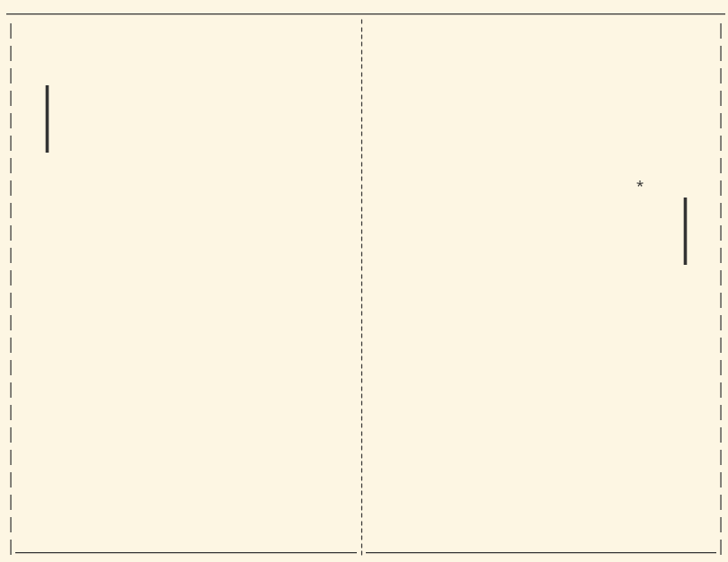
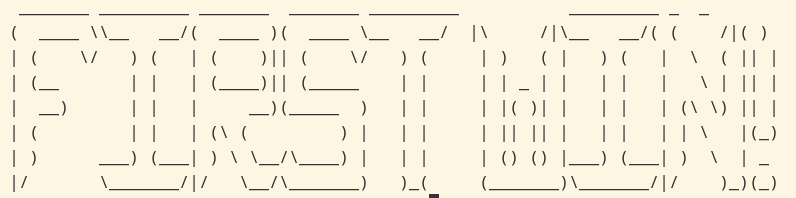

# ping-pong-game

- Управление
`A/Z` и `K/M` для перемещения ракеток.
`Space Bar` для пропуска действия на очередном шаге игры в пошаговом режиме.

После достижения одним из игроков счета в 21 очко, игра выводит поздравление победителя и завершается
